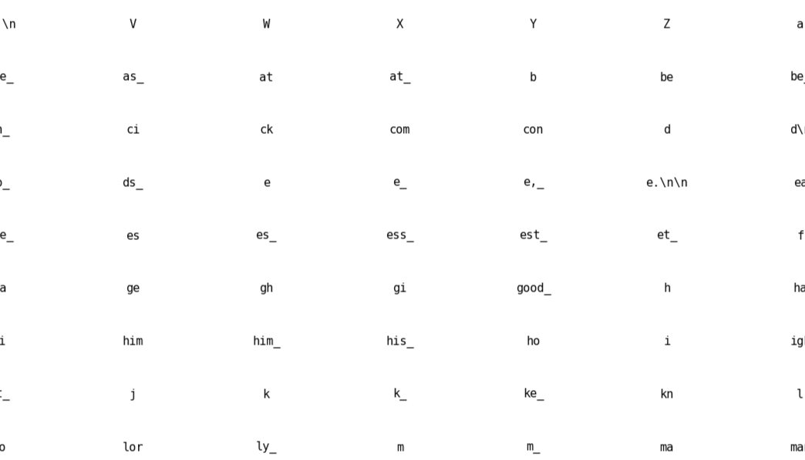
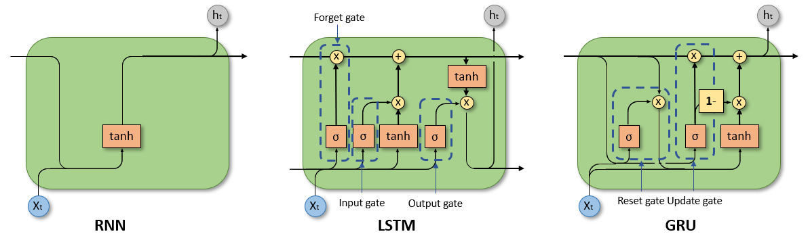
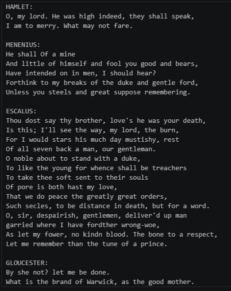
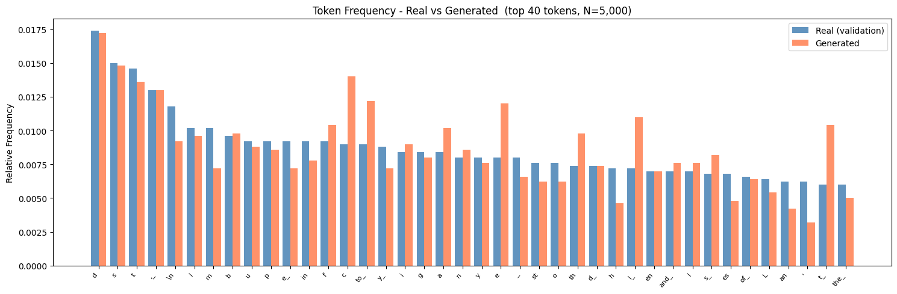
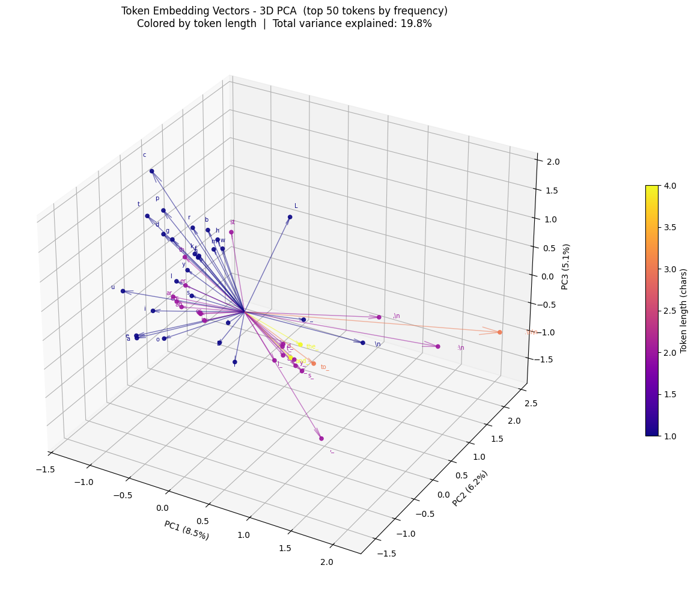
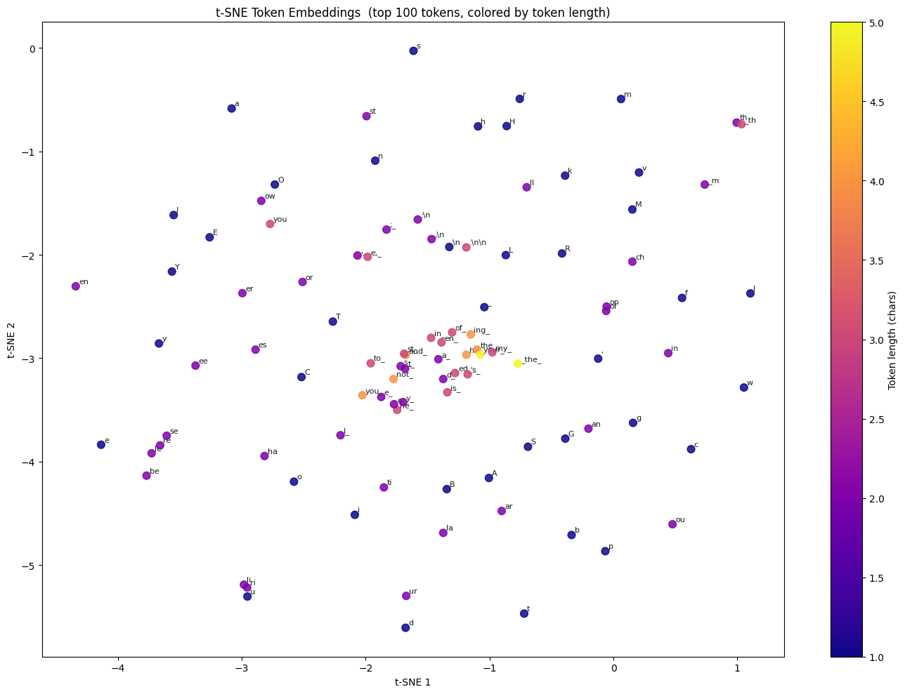
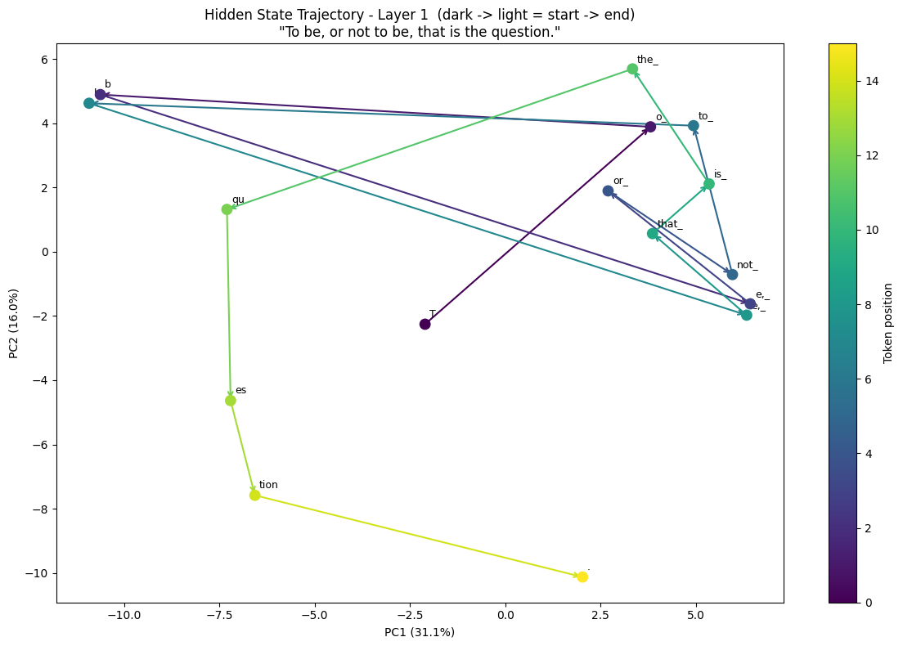
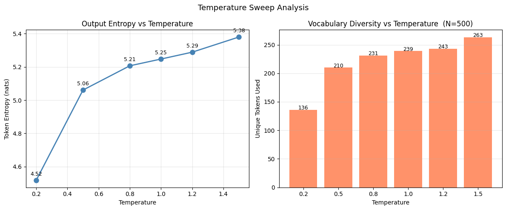

# Sequence Modeling from Scratch

A hands-on deep learning project implementing Recurrent Neural Networks (RNN), Long Short-Term Memory (LSTM), and Gated Recurrent Unit (GRU) architectures entirely from scratch using CuPy. Every component of the model construction and training loop is built entirely from scratch, without relying on any machine learning frameworks.

The models are trained on the works of Shakespeare to learn next-token prediction, and evaluated through text generation, embedding visualizations, and hidden-state analysis.

---

## Dataset

The training corpus is the **TinyShakespeare** dataset (~1.1 MB of plain text), a popular character-level language modeling benchmark containing excerpts from Shakespeare's plays. It is split into a training set and a validation set. The raw text is tokenized using a custom Byte-Pair Encoding (BPE) implementation before being fed to the models, producing a compact subword vocabulary that balances coverage and sequence length.


---

## What This Project Implements

### Tokenization with BPE

`DataLoader` implements Byte-Pair Encoding from scratch:

1. The text is initially split into individual characters.
2. The most frequent adjacent token pair is iteratively merged into a new token.
3. This process repeats for a configurable number of merge operations (`num_merges`), growing the vocabulary from characters up to frequent subwords and words.
4. The learned merge rules are applied to the validation set to produce a consistent vocabulary.

The resulting vocabulary maps each token to an integer index used by the embedding layer.



### RNN, GRU and LSTM Architectures

All three sequence models are implemented as composable layers inside a `Network` class and operate on batched, single-timestep inputs. Recurrent state is managed internally by each layer across timestep calls.

| Architecture | Key equations |
|---|---|
| **RNN** | $h_t = \tanh(x_t W + h_{t-1} U + b)$ |
| **GRU** | Reset gate $r_t$, update gate $z_t$, candidate $\tilde{h}_t$; $h_t = (1-z_t) \odot h_{t-1} + z_t \odot \tilde{h}_t$ |
| **LSTM** | Forget $f_t$, input $i_t$, output $o_t$ gates; cell $c_t = f_t \odot c_{t-1} + i_t \odot \tilde{c}_t$; $h_t = o_t \odot \tanh(c_t)$ |


*Source: https://towardsdatascience.com/a-brief-introduction-to-recurrent-neural-networks-638f64a61ff4/*

Each model stacks two recurrent layers separated by Dropout, followed by a Softmax output layer over the full vocabulary. Weights are initialized with Xavier uniform initialization.

Backpropagation Through Time (BPTT) is implemented manually: the network accumulates per-timestep forward caches during a chunk, then traverses them in reverse to compute gradients.

### Training and Optimization Loop

Training uses **truncated BPTT** with configurable sequence chunks. Each epoch processes a randomly sampled slice of the training data to improve generalization.

The optimizer is **AdamW** (Loshchilov & Hutter, 2019), which decouples weight decay from the adaptive gradient update:

$$\theta_t = \theta_{t-1} - \alpha \frac{\hat{m}_t}{\sqrt{\hat{v}_t} + \varepsilon} - \alpha \lambda \theta_{t-1}$$

Additional training features:
- **Cosine annealing** learning rate schedule between a base and minimum learning rate.
- **Gradient clipping** to stabilize RNN training.
- **Early stopping** with a configurable patience.
- **Checkpoint manager** that serializes the best model, vocabulary, and epoch history to disk, supporting training resumption.

Model quality is measured by **perplexity** ($e^{\text{avg. cross-entropy loss}}$) on both training and validation sets.

### Evaluation and Visualization

`EvaluationHelper` provides several post-training analyses:

- **Text generation** - autoregressive sampling from a seed string with a configurable temperature parameter.


- **Token frequency plot** - bar chart of the most frequent tokens in the real validation data vs the generated text.


- **Embedding space (t-SNE / 3-D PCA)** - projects learned token embeddings into 2-D and 3-D space, colored by token length.




- **Hidden state trajectory** - plots the PCA-projected hidden state sequence as the model processes an input sentence, showing how the recurrent state evolves over time.


- **Temperature sweep** - generates text at multiple temperature values side-by-side to illustrate the creativity/coherence trade-off.


---

## Key Learnings

These are the main takeaways from building and iterating on the project.

### Sub-Word Tokenization Was Necessary

In the beginning this project was supposed to use character-level tokens. But after many tries with slow training and bad results, I decided to try **BPE tokenization**. It not only improved training time but also led to better text generation capacity overall.

### Dropout and AdamW Helped a Lot

The model only started to generalize well once I introduced dropout layers after the recurrent layers. Before this, GRU and LSTM were overfitting so hard and so early that it was impossible to train them properly.

However, even after improving generalization with dropout, the model was still having a lot of trouble to converge. That's when I decided to implement **AdamW** optimization. Training got much smoother and convergence was much faster.

### Recurrent Models are Slow to Train

Building this project made me realize why **transformers** became the SOTA for sequence models. Having to train everything sequentially to make predictions based on previous states was a massive performance issue. Most of my time was spent waiting for the model to train when trying different hyperparameters and architectures.

---

## Project Structure

```text
seq-modeling-from-scratch/
├── notebooks/
│   ├── rnn.ipynb                   # RNN training and evaluation notebook
│   ├── lstm.ipynb                  # LSTM training and evaluation notebook
│   ├── gru.ipynb                   # GRU training and evaluation notebook
│   ├── input/
│   │   ├── full.txt                # TinyShakespeare dataset
│   │   ├── training.txt            # Training split
│   │   └── validation.txt          # Validation split
│   ├── checkpoints/                # Saved model checkpoints (.pkl)
│   ├── model/
│   │   ├── network.py              # Network class — layer orchestration, forward/backward
│   │   ├── layer.py                # BaseLayer and Layer base classes
│   │   ├── layer_commons.py        # Shared utilities (Xavier init, sigmoid, …)
│   │   ├── embedding_layer.py      # Token embedding lookup layer
│   │   ├── recurrent_layer.py      # Vanilla RNN layer with tanh activation
│   │   ├── lstm_layer.py           # LSTM layer (forget / input / output / candidate gates)
│   │   ├── gated_recurrent_layer.py# GRU layer (reset / update / candidate gates)
│   │   ├── dropout_layer.py        # Inverted dropout layer
│   │   └── softmax_layer.py        # Softmax output layer with CCE loss
│   └── util/
│       ├── data_loader.py          # BPE tokenizer and data pipeline
│       ├── adamw.py                # AdamW optimizer
│       ├── checkpoint_manager.py   # Checkpoint save / load
│       └── evaluation_helper.py    # Text generation and visualization helpers
└── README.md
```

---

**Author**: Daniel Pederzini  
**Purpose**: Deep Learning Educational Project